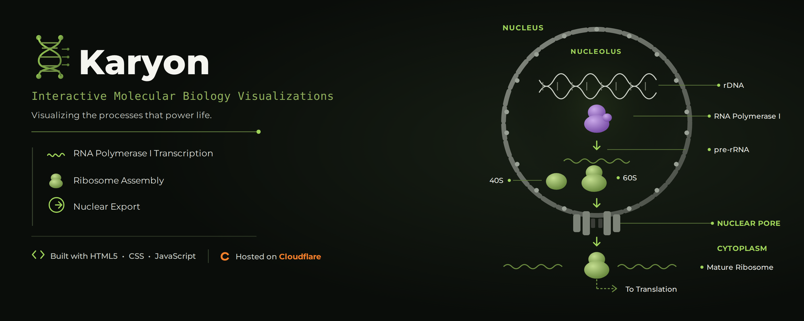

  

# 🧬 Karyon

### *Interactive Molecular Biology Visualization Library*

> **Karyon** is an interactive visualization library exploring **transcription, ribosome biogenesis, and nuclear export**.
>
> 🧬 **Molecular Biology** · 🧪 **Transcription** · 🔬 **Cellular Processes**

**🔬 [Explore the Simulation](YOUR-LINK-HERE)**

---

## ✦ Features

**🧬 Scientific Visualizations**  
Explore interactive simulations of molecular and cellular processes.

**🧪 rDNA Transcription**  
Visualize RNA Polymerase I-mediated rDNA transcription and pre-rRNA processing.

**🔬 Ribosome Biogenesis**  
Explore pre-rRNA processing and ribosome assembly.

**🚀 Nuclear Export**  
Visualize the transport of ribosomal subunits from the nucleus.

**📱 Responsive Design**  
Optimized for modern desktop and mobile devices.

---

## 🧬 Core Concepts

**rDNA Transcription · RNA Polymerase I · Pre-rRNA Processing · Ribosome Biogenesis · Nuclear Export · Ribosomal Subunits**

---

## ⚙️ Technology

**HTML5 Canvas · CSS3 · JavaScript**

**Repository:** GitHub & Codeberg  
**Hosting:** GitHub Pages

---

## 📜 License

Distributed under the **GNU General Public License v3.0 (GPL-3.0)**.
