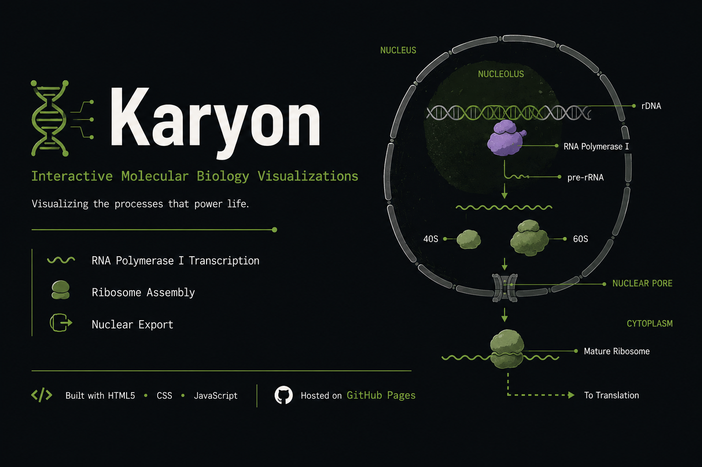

  

# 🧬 Karyon

Interactive HTML5 visualization library demonstrating molecular biology processes including transcription, ribosome biogenesis, and nuclear export.

---

## ✨ Features

* **Scientific Visualizations:** Interactive simulations of molecular and cellular processes.
* **Current Module:** RNA Polymerase I-mediated rDNA transcription and pre-rRNA processing.
* **Educational Workflow:** Browser-based interface designed for biology education and scientific communication.
* **Responsive Design:** Optimized for desktop and mobile devices.

---

## 🚀 Built With & Hosted On

* **Technology:** HTML5 Canvas, CSS3 & JavaScript
* **Hosting:** GitHub Pages

---

## 🛠️ Credits & Acknowledgments

* **Moonshot AI:** Initial draft & concept exploration.
* **Claude:** Code architecture & implementation.
* **Replit:** Debugging & rapid prototyping.
* **OpenAI:** Scientific debugging, testing & prompt refinement.

---

## 👤 Author

**Draven-Ashcroft**  
DIPS Chain of Institutions, Tanda

---

## 📜 License

GPL-3.0
